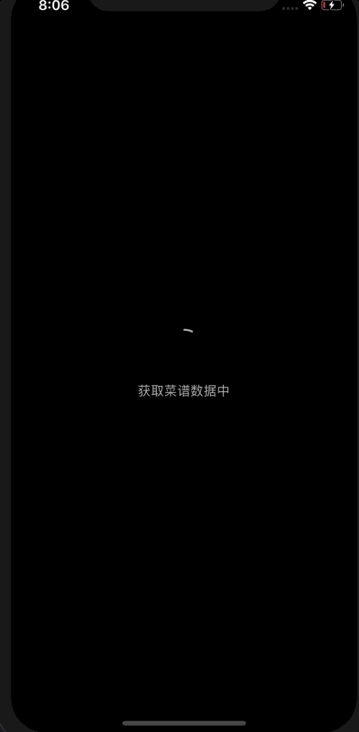

## react-native-magic-list

animate for FlatList items.

## 1. Examples

<p align="center">
  
</p>

## 2. Basic Usage

how to use react-native-magic-list?:

```bash
npm install react-native-magic-moving --save
```

example for how to use in Demo:

```javascript
import React from 'react';
import { View } from 'react-native';
import { MagicFlatList } from 'react-native-magic-list';

const mockedData = Array(10).fill(1);

export class Demo extends React.Component {
	render() {
		return (
			<MagicFlatList
        data={mockedData}
        animateType="floatFromBottom"
				renderItem={() => (
					<View style={{ width: 100, height: 100, backgroundColor: 'red' }} />
				)}
			/>
		);
	}
}
```

- props：

| key     | description     | type          | default |
| -------- | -------- | ------------- | ------ |
| renderItem    | Rendering component     | function | () => void   |
| delay | each item's delay | number      | 200   |
| animateType    |  Entry animation type | array or string    |  'floatFromBottom'  |
| touchAnimateType | Touch the animation | string      | 'scale'   |
| FlatList.propTypes | Inherit FlatList's propTypes | any      | null   |

animateType is now support "floatFromBottom", "floatFromLeft", "floatFromRight", "scale"，When you need to use the entrance animation you can choose the following two ways: animateType="floatFromBottom" or animateType=["floatFromBottom", '"floatFromLeft"]
